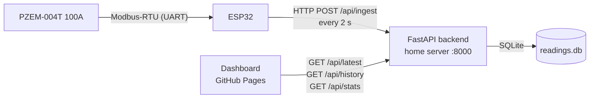

# ESP32 Power Meter

A complete home power-monitoring system: an **ESP32** reads a **PZEM-004T (100 A)** energy-meter module and pushes readings every 2 seconds to a small **Python (FastAPI) backend** running on your home server. A static **dashboard hosted on GitHub Pages** pulls the data from that backend and shows live values and history graphs for every metric.



## Repository layout

| Directory | What it is |
|---|---|
| [`firmware/`](firmware/) | ESP32 firmware (PlatformIO / Arduino IDE) — PZEM readings, WiFiManager pairing, status LED, reset button |
| [`server/`](server/) | Python FastAPI backend — receives readings, stores them in SQLite, serves the dashboard API (Docker Compose ready) |
| [`docs/`](docs/) | Static dashboard — served by GitHub Pages, shows live tiles + history charts for all metrics |

## Hardware

- ESP32 dev board (any common devkit)
- PZEM-004T **100 A** module (external CT coil version; Modbus-RTU protocol)
- 1 LED (status indicator — the onboard LED on GPIO 2 works out of the box)
- 1 push button (WiFi reset / pairing)

| PZEM-004T | ESP32 |
|---|---|
| TX | GPIO 16 (RX2) |
| RX | GPIO 17 (TX2) |
| VCC | 5 V (VIN) |
| GND | GND |

| Part | ESP32 |
|---|---|
| LED (+ 220 Ω to GND) | GPIO 2 |
| Push button (to GND) | GPIO 13 |

**LED codes:** fast blink = pairing portal open · medium blink = connecting to WiFi · solid = connected and server reachable · slow blink = WiFi OK but server unreachable.

**Button:** hold **5 seconds** to erase WiFi credentials and reboot into pairing mode (`PowerMeter-Setup` access point).

## Getting started

Set things up in this order:

### 1. Backend (home server)

```bash
cd server
cp .env.example .env   # set your API key
docker compose up -d
```

The API listens on port **8000**. See [`server/README.md`](server/README.md) — including the important **HTTPS / mixed-content** section: GitHub Pages is served over HTTPS, so the browser will only call your backend if it is also reachable over HTTPS (e.g. behind Nginx Proxy Manager with a DuckDNS domain and Let's Encrypt).

### 2. Firmware (ESP32)

Flash `firmware/` with PlatformIO or the Arduino IDE, then power up. The ESP32 opens a `PowerMeter-Setup` access point — join it, and in the portal pick your WiFi and enter the backend URL, API key, and device ID. Full walkthrough in [`firmware/README.md`](firmware/README.md).

### 3. Dashboard

The dashboard is published automatically from `docs/` via GitHub Pages. Open it, tap the gear icon, and enter your backend URL. Settings are stored locally in your browser.

## Try it without hardware

[`tools/mock_esp32.py`](tools/mock_esp32.py) simulates the whole device — a house with a fridge cycling, a kettle spiking, lights and AC switching on and off — and posts the exact same payload the firmware does. Stdlib only, no dependencies.

```bash
# Terminal 1 — the backend
cd server && API_KEY=demo-key-12345 \
  DB_PATH=./data/powermeter.db uvicorn main:app --port 8000

# Terminal 2 — seed 6 h of history, then stream live every 2 s
python3 tools/mock_esp32.py --backfill 6 --key demo-key-12345
```

Open `docs/index.html` (or the hosted dashboard) and point it at `http://localhost:8000`. About 1% of readings are sent as nulls on purpose, simulating a failed PZEM read, so the chart gap handling gets exercised too.

## Exposing a local backend

GitHub Pages is HTTPS, so the dashboard can only reach an HTTPS backend. To demo from a laptop, tunnel it:

```bash
# ngrok — needs a free account authtoken, one time
ngrok config add-authtoken YOUR_TOKEN
ngrok http 8000

# or Cloudflare quick tunnel — no account needed
cloudflared tunnel --url http://localhost:8000
```

Paste the resulting HTTPS URL into the dashboard's settings panel, or set `DEFAULT_BASE_URL` at the top of [`docs/app.js`](docs/app.js) to bake it in.

> Both of the above hand out a **random URL that changes on every restart**. For something permanent, use an ngrok static domain (one is included free), or a named Cloudflare tunnel on a domain you own. For a real always-on install, the intended setup is the backend on your home server behind a reverse proxy with a Let's Encrypt certificate — see [`server/README.md`](server/README.md).

## API overview

| Endpoint | Purpose |
|---|---|
| `POST /api/ingest` | ESP32 pushes a reading (voltage, current, power, energy, frequency, power factor, RSSI, uptime) |
| `GET /api/latest` | Most recent reading + online flag |
| `GET /api/history?minutes=&max_points=` | Downsampled time series for charts |
| `GET /api/stats?hours=` | Energy used, average/max power, voltage range over a window |
| `GET /api/health` | Health check |

## License

[MIT](LICENSE)
