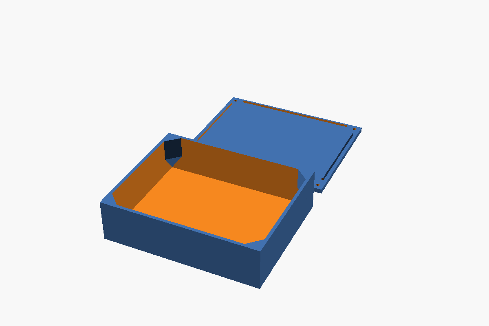

# Enclosure

A 3D-printable box with a screw-on lid for the power meter.



| | |
|---|---|
| **Outside** | 100 × 80 × 30 mm |
| **Inside** | 96 × 76 × 25 mm |
| **Walls / floor / lid** | 2 mm / 2 mm / 3 mm |
| **Fixings** | 4 × M2 self-tapping screws, 12 mm (one per corner) |
| **Openings** | **none at all in the box** — not even screw pilots. Drill to suit. |
| **Supports** | none, either part |

> [!WARNING]
> **Read [Mains safety](#mains-safety) before you put this near mains wiring.**
> This is a bench and prototyping housing. It is not a certified mains
> enclosure, and **PLA must not be used for it.**

## Files

| File | What it is |
|---|---|
| [`enclosure.scad`](enclosure.scad) | The parametric source. Everything is a named variable at the top. |
| `box.stl` / `lid.stl` | Ready to slice, generated from the defaults. |
| [`test_variants.sh`](test_variants.sh) | Renders every optional configuration and checks each is still watertight. |

Re-export after changing anything:

```bash
openscad -D 'part="box"' -o box.stl enclosure.scad
openscad -D 'part="lid"' -o lid.stl enclosure.scad
./test_variants.sh          # 14 configurations, all must report manifold
```

## Will your boards fit?

Yes, but **lay them out lengthwise** — that is the one constraint at this size.
Side by side with their long axes along the 96 mm direction:

```
  PZEM-004T   74 x 31 mm   |   ESP32 devkit   55 x 28 mm

  31 + 28 = 59 mm across the 76 mm width   ->  17 mm spare
  longest board 74 mm along the 96 mm length  ->  fits
```

Turned the other way, the PZEM's 74 mm length would have only 76 mm to sit in,
leaving nothing for the ESP32 beside it.

**On height, the PZEM sets the floor**, and it is why this cannot be a 20 mm box.
Its 5.08 mm-pitch screw terminals stand 10.0 mm above the PCB:

```
  5.0 mm   M3 nylon standoff (clears the terminal's 3.7 mm pins underneath)
+ 1.6 mm   PCB
+ 10.0 mm  screw terminal block
= 16.6 mm  — a 20 mm box gives a 16 mm cavity, so it does not close
```

At 30 mm the cavity is 25 mm, leaving **8.4 mm of headroom** for wiring above the
terminals. Some vendors list the whole module at 16–18 mm tall, so if yours is one
of those, put a caliper on it before printing.

Using different hardware? Measure it and set the three `outer_` values —
everything else derives from them, and the file prints a warning if the cavity
drops below 22 mm.

## Screws

**4 × M2 self-tapping, 12 mm** — one per corner. With the 3 mm lid that gives
about 9 mm of thread engagement.

They do not thread into cylindrical posts. Each corner is filled with a **45°
gusset** running 12 mm along both walls, so the screw material *is* the corner.
It reads as part of the shell rather than a cylinder stuck onto it, and there is
no thin post-to-wall junction to crack along. The lid's locating lip is cut back
around each gusset so it never fouls them.

The gussets are also **kept as small as the job allows**, because a full-height
prism in each corner is mostly plastic doing nothing:

- M2 needs far less meat than M3. At 12 mm with the screw 4 mm in, there is
  1.95 mm of material around the pilot out to the diagonal face — above the
  ~1.5 mm that thread-forming into plastic wants. Any smaller and the diagonal
  starts cutting into the hole.
- The screw only engages the top 10 mm, so the gusset is full size for the top
  14 mm and then **tapers down** to a 4 mm footprint at the floor.

Measured off the rendered STLs at this size, that takes the four gussets from
**7.20 cm³ to 2.26 cm³ — a 69% cut**, 4.9 cm³ of filament, about 12% of the whole
box. The
taper still needs no supports: its downward faces sit 66.5° off straight-down,
comfortably clear of the 45° limit, and `test_variants.sh` asserts no facet in
either part falls below that.

### Drilling the pilots

**The box prints with no screw holes** — the gussets are left solid. Use the lid
as a drill template:

1. Sit the lid on the box, lined up with the outside edges.
2. Drill down through the lid's four clearance holes into the gussets.
3. Aim for about 10 mm deep — that stays inside the full-size top section of the
   gusset. A hand drill is plenty.

Doing it this way means the two parts physically cannot end up misaligned, which
is the usual failure with pre-modelled holes and a slightly shrunk print.

Prefer them modelled? Set `pilot_holes = true`.

Four screws were a concern at the original 150 × 100 size, where the lid spanned
146 mm unsupported and a 3 mm plate bowed about half a millimetre mid-edge. **At
96 × 76 that worry mostly goes away** — plate deflection scales with the fourth
power of the span, so shrinking it to 96 mm cuts the bow to under a fifth of that,
around 0.1 mm. Corner-only fixing is genuinely fine here.

If you ever scale the box back up and the seam starts showing a gap mid-span,
raise `lid_t` to 4 or uncomment the mid-wall positions in `screw_xy()` (they would
need their own bosses, since the gussets only cover corners).

Use a **slightly bigger bit than the textbook 1.6 mm** for M2. In moulded plastic
1.6 is right; in a printed part a tight pilot splits the material on first
assembly, because the layers give it a plane to split along.

| Material | Pilot |
|---|---|
| PLA | 1.8 mm |
| PETG / ABS / ASA | 1.7 mm |
| Nylon | 1.6 mm |

Hand-tighten only — roughly **0.1 Nm**, which is not much; M2 threads in plastic
strip easily. Use a hex or Torx driver rather than a Phillips, which cams out and
tempts you to lean on it, and never a power driver. If the box will be opened
often, use **M2 heat-set brass inserts** instead (typically 3.2 mm OD × 4 mm) —
set `screw_pilot_d` to the insert bore and drill for that. The gussets have the
material for it without any other change.

## Printing

Both parts sit flat on the bed and need **no supports**.

> The lid is modelled lip-**up**, which is how it must print. Do not flip it
> lip-down — that suspends the whole 100 × 80 plate over the lip and needs
> full supports. Want a nicer outer face? Use a textured build plate.

| Setting | Value |
|---|---|
| Layer height | 0.2 mm (0.25 mm first layer, 20 mm/s) |
| Wall extrusion width | 0.50 mm |
| Wall loops | **5** for the box, 4 for the lid |
| Top / bottom solid layers | 5 / 4 |
| Infill | irrelevant — nothing in either part has any |
| Supports | off |
| Brim | 3 mm on the lid (cheap insurance); 5 mm for ABS |
| Seam position | aligned or rear, so it misses the lip's mating face |

Wall loops matter more than they look: at 4 × 0.50 mm the 2 mm wall comes out as
one continuous solid. Leave the default 0.45 mm width and you get gap-fill and a
sliver of infill inside a wall that should be solid.

The 100 × 80 mm footprint fits every common printer, including a Bambu A1 mini
(180²), which the earlier 150 × 100 version did not.

If the lid binds, increase `lip_clear` (0.45 default, try 0.6). It tapers inward
as it rises so it self-centres, which forgives a little wall bow.

## Cable entries

**The box prints sealed — there are no openings.** Drill your own once the boards
are positioned: with only 2 mm of wall a hand drill or a reamer cuts one in
seconds, and you get to put it exactly where the cable actually lands instead of
where a model guessed.

If you would rather model them, `holes_x0` and `holes_x1` take
`[y_position, diameter, z_centre]` and cut through the short ends. Two things to
get right. **Size for a gland, not for the cable** — 3-core 1.5 mm² mains flex is
8.1 mm across, so it would not even pass an 8 mm hole, and 8 mm matches no gland
thread made. And **a bare printed hole is not strain relief**: a tug on the cable
goes straight to the screw terminal.

| Gland | Hole | Cable range |
|---|---|---|
| PG7 / M12×1.5 | 12.5 mm | 3–6.5 mm |
| PG9 | 15.2 mm | 4–8 mm |
| M16×1.5 | 16.2 mm | 4–8 mm |
| PG11 | 18.6 mm | 5–10 mm |
| M20×1.5 | 20.2 mm | 6–12 mm |

Heights are per hole rather than auto-centred, so a USB opening stays aligned to
the actual connector instead of drifting whenever `outer_z` changes. Two helper
values are defined for it: `mid_z` (vertical centre of the cavity) and `usb_z`
(a micro-USB port on a board sitting on 8 mm standoffs).

## Mounting your boards

`standoffs` is **empty by default** and that is deliberate — hole spacing varies
between PZEM-004T and ESP32 board revisions, and a standoff in the wrong place is
worse than none. Measure yours, then fill in `[x, y, height, outer_d, pilot_d]`.

One trap: an ESP32 devkit with its male headers still fitted has about **6 mm of
pin sticking out below the PCB**, so it needs a standoff of at least 7–8 mm. The
obvious 4 mm jams the pins into the floor.

`mount_ears = true` adds external wall-mounting tabs (this grows the footprint to
100 × 100). Never screw through the bare floor instead — it breaches the
enclosure and cracks the 2 mm base.

## Mains safety

The PZEM measures mains voltage, so live conductors enter this box. A review of
this design flagged the following, and the honest summary is:

**Use this printed box for bench work and prototyping. For a permanent,
unattended installation, put the electronics in an off-the-shelf ABS or PC
IP65 junction box** (UL 94 V-0, 960 °C glow-wire, moulded gland entries) — one
costs less than the filament, and the printed part can be reduced to an internal
mounting tray if you like.

If you do build it in plastic you printed yourself:

- **Never PLA.** Glass transition around 60 °C and it creeps under sustained
  screw preload. **PETG at minimum**; ABS/ASA is better; a UL 94 V-0 rated
  filament (PETG-FR, ABS-FR, PC-FR) is what the job actually calls for. Hobby
  filament carries no flammability, tracking or glow-wire rating at all.
- **Fuse the voltage tap.** An inline 500 mA–1 A **ceramic** HRC fuse, 250 V AC,
  in the live sense lead, as close to the tap as possible, in an enclosed
  holder. Ceramic specifically — a glass fuse lacks the breaking capacity. Feed
  from a fused spur or a 2 A MCB way, on a circuit behind a 30 mA RCD.
- **Separate mains from low voltage.** Set `divider = true` for a full-height
  barrier between the PZEM's terminals and the ESP32/LED/button, with a notch
  at the far edge for the UART wires. An undivided cavity puts live terminals in
  the same space as parts you can touch.
- **Use glands, not holes**, and add a slack loop inside so a tug on the cable
  cannot reach the terminal.
- **PZEM v3.0 or v4.0 only.** Older revisions lack opto-isolated TTL, which
  would put the ESP32 and its USB port at mains potential. Even on v3.0/v4.0 the
  isolation is *functional*, not safety-rated: never touch the ESP32, LED or
  button while mains is connected, and **never plug in USB while the mains side
  is live.** Flash and debug with mains fully disconnected.
- **Keep every metal part inaccessible.** The screw shafts pass into the cavity.
  Use nylon M2 screws, or raise `lid_t` to 3.5, enable `lid_counterbore` and plug
  the recesses. Plastic-bodied button and LED bezel, both on the low-voltage
  side. Nylon glands. This is a Class II design — do not try to earth a printed
  box.
- **Fix the boards down.** Nothing should be able to shift onto a live terminal.
  Keep `tie_slots = false` for any mains build; it pierces the floor.
- **The CT clamps one conductor only**, never live and neutral together. Do not
  open the clamp or unplug its lead while the conductor is carrying current.
- **Wall thickness.** For a mains build set `wall = 3` and `floor_t = 3`.
